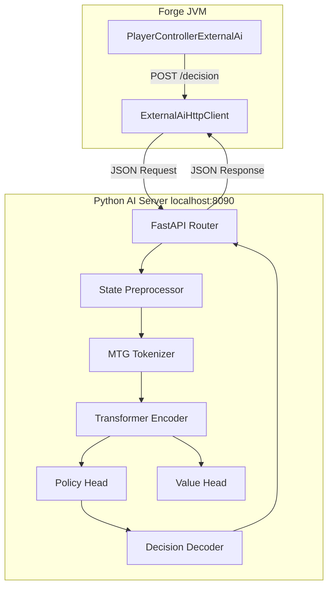
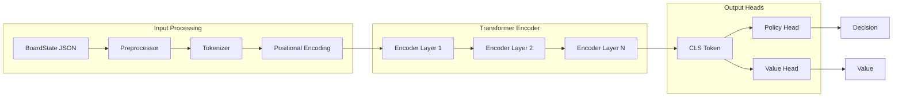
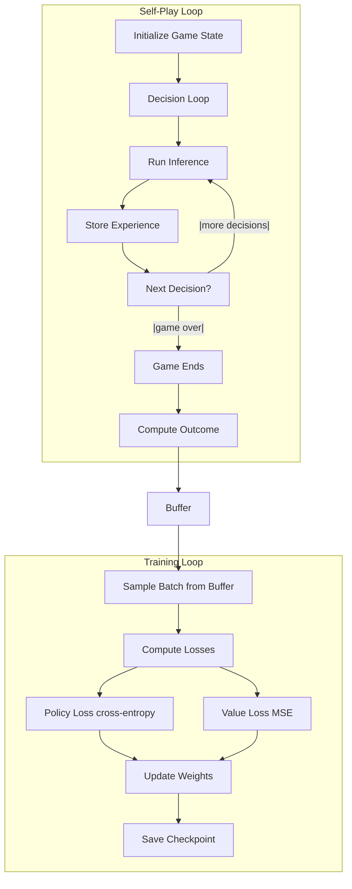

# Arcbound Playtester — Transformer-Based MTG AI Server

## Overview

This document plans a transformer encoder-based AI server that learns to play Magic: The Gathering. The server receives complete board state JSON from Card Forge via HTTP REST API, encodes the state through a transformer model, and returns decisions matching the Forge external AI contract.

**Key Design Goals:**
- Transformer encoder architecture for board state understanding
- Self-play training loop for unsupervised learning
- Complete zone visibility (hand, graveyards, exile, command zone, battlefield, library counts)
- Support for all decision types defined by Forge's [`PlayerController`](../forge/forge-game/src/main/java/forge/game/player/PlayerController.java)
- Fast inference (< 2 seconds per decision) to maintain gameplay flow

## System Architecture



## Project Structure

```
Arcbound-Playtester/
├── pyproject.toml
├── README.md
├── config/
│   ├── default.yaml              # Default server and model config
│   ├── training.yaml             # Training-specific config
│   └── inference.yaml            # Inference-only config
├── src/
│   ├── arcbound/
│   │   ├── __init__.py
│   │   ├── server.py             # FastAPI application
│   │   ├── routes/
│   │   │   ├── __init__.py
│   │   │   ├── decision.py       # POST /decision endpoint
│   │   │   ├── game.py           # POST /game/start, /game/end
│   │   │   └── health.py         # GET /health
│   │   ├── models/
│   │   │   ├── __init__.py
│   │   │   ├── board_state.py    # Pydantic models matching Java BoardState
│   │   │   ├── decision.py       # Pydantic models matching AiDecisionRequest/Response
│   │   │   └── card.py           # Card representation
│   │   ├── encoder/
│   │   │   ├── __init__.py
│   │   │   ├── transformer.py    # Transformer encoder model
│   │   │   ├── tokenization.py   # MTG-specific tokenization
│   │   │   └── features.py       # Feature extraction from board state
│   │   ├── decision/
│   │   │   ├── __init__.py
│   │   │   ├── engine.py         # Decision-making engine
│   │   │   ├── policy.py         # Policy network head
│   │   │   └── value.py          # Value network head
│   │   ├── training/
│   │   │   ├── __init__.py
│   │   │   ├── trainer.py        # Training loop
│   │   │   ├── self_play.py      # Self-play data generation
│   │   │   ├── replay_buffer.py  # Experience replay buffer
│   │   │   └── reward.py         # Reward computation
│   │   └── utils/
│   │       ├── __init__.py
│   │       ├── logging.py        # Structured logging
│   │       └── config.py         # Config loading
├── scripts/
│   ├── start_server.sh           # Start inference server
│   ├── start_training.sh         # Start training loop
│   └── generate_data.sh          # Generate self-play data
├── checkpoints/                  # Model checkpoints (gitignored)
├── data/                         # Training data (gitignored)
└── tests/
    ├── conftest.py
    ├── test_server.py
    ├── test_models.py
    ├── test_encoder.py
    ├── test_decision.py
    └── test_training.py
```

## API Contract

The Python server must match the Java [`ExternalAiHttpClient`](../forge/forge-external-ai/src/main/java/forge/externalai/http/ExternalAiHttpClient.java) endpoints exactly.

### Endpoints

| Method | Path | Purpose | Java Caller |
|--------|------|---------|-------------|
| POST | `/decision` | Main decision endpoint | [`ExternalAiHttpClient.requestDecision()`](../forge/forge-external-ai/src/main/java/forge/externalai/http/ExternalAiHttpClient.java:75) |
| POST | `/game/start` | Game start notification | [`ExternalAiHttpClient.notifyGameStart()`](../forge/forge-external-ai/src/main/java/forge/externalai/http/ExternalAiHttpClient.java:141) |
| POST | `/game/end` | Game end notification | [`ExternalAiHttpClient.notifyGameEnd()`](../forge/forge-external-ai/src/main/java/forge/externalai/http/ExternalAiHttpClient.java:165) |
| GET | `/health` | Health check | [`ExternalAiHttpClient.isServerAvailable()`](../forge/forge-external-ai/src/main/java/forge/externalai/http/ExternalAiHttpClient.java:191) |

### Request/Response Schema

The Python Pydantic models must match the Java DTOs exactly. Field names use snake_case in Python but serialize to the Java-expected names.

#### POST /decision Request

Matches [`AiDecisionRequest`](../forge/forge-external-ai/src/main/java/forge/externalai/AiDecisionRequest.java):

```python
class DecisionContext(BaseModel):
    type: str                          # e.g. "boolean", "card", "cards", "color"
    description: str                   # Human-readable description
    options: list[Option]              # Available options
    constraints: Constraints | None    # Choice constraints
    prompt: str | None                 # Prompt text

class Option(BaseModel):
    id: str                            # Option identifier
    type: str                          # Option type
    label: str                         # Display label
    details: dict[str, Any] | None     # Additional details

class Constraints(BaseModel):
    min_choices: int = 0
    max_choices: int = 1
    is_optional: bool = False
    allow_none: bool = False

class AiDecisionRequest(BaseModel):
    game_id: str
    board_state: dict[str, Any]        # Full BoardState as nested dict
    decision_context: DecisionContext
```

#### POST /decision Response

Matches [`AiDecisionResponse`](../forge/forge-external-ai/src/main/java/forge/externalai/AiDecisionResponse.java):

```python
class AiDecisionResponse(BaseModel):
    decision_id: str
    decision_type: str                 # Matches decision context type
    value: dict[str, Any]              # Decision value (type-dependent)
    reasoning: str | None              # Human-readable reasoning
    selected_option_id: str | None     # Single option selection
    selected_option_ids: list[str] | None  # Multiple option selection
```

#### BoardState Schema

Matches [`BoardState`](../forge/forge-external-ai/src/main/java/forge/externalai/boardstate/BoardState.java):

```python
class CardInfo(BaseModel):
    id: str
    name: str
    oracle_name: str | None
    mana_cost: str | None
    converted_mana_cost: int | None
    colors: list[str] | None
    color_identity: list[str] | None
    types: list[str] | None
    supertypes: list[str] | None
    subtypes: list[str] | None
    text: str | None
    power: int | None
    toughness: int | None
    loyalty: int | None
    damage: int | None
    counters: dict[str, int] | None
    tapped: bool | None
    attacking: bool | None
    blocking: bool | None
    flipped: bool | None
    face_down: bool | None
    owner: str | None
    controller: str | None
    zone: str | None
    abilities: list[str] | None
    keywords: list[str] | None
    revealed_to: list[str] | None

class PlayerState(BaseModel):
    name: str
    life: float
    starting_life: float = 20.0
    poison_counters: int = 0
    mana_pool: dict[str, int] | None
    commanders: list[CardInfo] | None
    commander_damage: dict[str, int] | None
    commander_tax: int | None
    battlefield: list[CardInfo]
    hand: list[CardInfo]
    graveyard: list[CardInfo]
    exile: list[CardInfo]
    command_zone: list[CardInfo] | None
    library_size: int
    sideboard_size: int | None
    hand_hidden: bool = False
    is_focal: bool = False

class BoardState(BaseModel):
    game_id: str
    active_player: str
    turn: int
    phase: str
    focal_player: str
    players: list[PlayerState]
    stack: list[CardInfo] | None
```

## Transformer Encoder Architecture

### Overall Design

The transformer encoder processes the board state as a sequence of tokenized elements. Each element (card, player, game state) is converted to a token embedding, passed through transformer encoder layers, and the resulting representations feed into policy and value heads.



### Tokenization Strategy

Magic: The Gathering board states are heterogeneous and hierarchical. The tokenizer flattens the board state into a linear sequence of tokens while preserving structure through special tokens.

**Token Categories:**

| Category | Tokens | Description |
|----------|--------|-------------|
| Structure | `[GAME]`, `[PLAYER]`, `[END_PLAYER]`, `[ZONE]`, `[CARD]`, `[END_CARD]`, `[STACK]`, `[END_GAME]` | Hierarchical delimiters |
| Card Identity | `[CARD:Name]` | Each unique card name gets a token |
| Mana | `[MANA:W]`, `[MANA:U]`, `[MANA:B]`, `[MANA:R]`, `[MANA:G]`, `[MANA:C]`, `[MANA:N]` | Mana symbols |
| Numbers | `[NUM:0]` through `[NUM:99+]` | Binned numeric values |
| Zones | `[ZONE:Hand]`, `[ZONE:Battlefield]`, `[ZONE:Graveyard]`, `[ZONE:Exile]`, `[ZONE:Library]`, `[ZONE:Command]` | Zone identifiers |
| Properties | `[TAPPED]`, `[UNTAPPED]`, `[ATTACKING]`, `[BLOCKING]`, `[FLYING]`, `[TRAMPLE]`, ... | Card states and keywords |
| Colors | `[COLOR:W]`, `[COLOR:U]`, `[COLOR:B]`, `[COLOR:R]`, `[COLOR:G]`, `[COLOR:C]` | Color identifiers |
| Types | `[TYPE:Creature]`, `[TYPE:Instant]`, `[TYPE:Sorcery]`, `[TYPE:Land]`, ... | Card types |
| Subtypes | `[SUBTYPE:Wizard]`, `[SUBTYPE:Mountain]`, ... | Card subtypes |
| Decision | `[DECISION]`, `[DECISION_TYPE:type]`, `[OPTION:id]` | Decision context |

**Tokenized Board State Example:**

For a simplified board state:
```
[GAME] [TURN:3] [PHASE:Main] [ACTIVE:Alice]
[PLAYER] [NAME:Alice] [FOCAL] [LIFE:20] [POISON:0]
  [ZONE:Hand]
    [CARD] [CARD:Lightning Bolt] [COLOR:R] [TYPE:Instant] [CMC:1] [END_CARD]
    [CARD] [CARD:Mountain] [TYPE:Land] [SUBTYPE:Mountain] [END_CARD]
  [ZONE:Battlefield]
    [CARD] [CARD:Mountain] [UNTAPPED] [TYPE:Land] [END_CARD]
    [CARD] [CARD:Giant Spider] [UNTAPPED] [TYPE:Creature] [SUBTYPE:Spider] [PT:2/1] [FLYING] [END_CARD]
  [ZONE:Graveyard]
  [LIBRARY:23]
[END_PLAYER]
[PLAYER] [NAME:Bob] [LIFE:18] [POISON:0]
  [ZONE:Hand] [HAND_HIDDEN]
  [ZONE:Battlefield]
    [CARD] [CARD:Island] [TAPPED] [TYPE:Land] [END_CARD]
  [LIBRARY:20]
[END_PLAYER]
[STACK]
[END_GAME]
[DECISION] [DECISION_TYPE:card] [OPTION:opt0] [OPTION:opt1]
```

**Vocabulary Size Estimate:**

| Category | Count | Notes |
|----------|-------|-------|
| Unique card names (oracle) | ~30,000 | One token per card name, NOT per printing |
| Structure tokens | ~20 | `[GAME]`, `[PLAYER]`, `[CARD]`, etc. |
| Mana tokens | 36 | WUBRG (5) + Colorless (1) + Generic (1) + Variable X (1) + Hybrid color/color (10) + 2brid (5) + Colorless-hybrid (5) + Phyrexian (6) + Snow (1) + Legendary (1) |
| Color tokens | 6 | `[COLOR:W]`, `[COLOR:U]`, `[COLOR:B]`, `[COLOR:R]`, `[COLOR:G]`, `[COLOR:C]` (colorless) |
| Number bins | ~100 | `[NUM:0]` through `[NUM:99+]` |
| Keywords/Abilities | ~500 | `[FLYING]`, `[TRAMPLE]`, etc. |
| Type/Subtype tokens | ~500 | `[TYPE:Creature]`, `[SUBTYPE:Wizard]`, etc. |
| Zone tokens | ~15 | `[ZONE:Hand]`, `[ZONE:Battlefield]`, etc. |
| Decision tokens | ~50 | Decision types and option markers |
| **Total** | **~31,200** | Manageable vocabulary size |

**Important: One Token Per Card Name, Not Per Printing.** "Lightning Bolt" has been printed in 50+ sets but gets a single token ID. All occurrences share the same token so the model learns from every game where any printing appears. Uses the `oracle_name` field from [`CardInfo`](../forge/forge-external-ai/src/main/java/forge/externalai/boardstate/BoardState.java) as the canonical identifier, not the printed set or collector number.

### Model Architecture

**Base Configuration:**

| Parameter | Value | Rationale |
|-----------|-------|-----------|
| Hidden dimension | 512 | Balance between capacity and inference speed |
| Feed-forward dimension | 2048 | 4x hidden dimension (standard) |
| Attention heads | 8 | Standard for 512-dim models |
| Encoder layers | 6 | Shallow for fast inference |
| Maximum sequence length | 4096 | Large boards with many cards |
| Dropout | 0.1 | Regularization |
| Activation | GeLU | Standard transformer activation |
| Layer norm | Pre-norm | Better training stability |

**Embedding Strategy:**

```python
class MTGTransformerEncoder(nn.Module):
    def __init__(self, vocab_size, d_model, nhead, num_layers, dim_feedforward, max_seq_len):
        self.token_embedding = nn.Embedding(vocab_size, d_model)
        self.position_embedding = nn.Embedding(max_seq_len, d_model)
        encoder_layer = nn.TransformerEncoderLayer(
            d_model=d_model,
            nhead=nhead,
            dim_feedforward=dim_feedforward,
            dropout=0.1,
            activation=F.gelu,
            batch_first=True,
            norm_first=True
        )
        self.encoder = nn.TransformerEncoder(encoder_layer, num_layers=num_layers)

    def forward(self, x):
        pos = torch.arange(0, x.shape[1], device=x.device).unsqueeze(0)
        out = self.token_embedding(x) + self.position_embedding(pos)
        return self.encoder(out)
```

### Policy Head

The policy head converts transformer outputs into a probability distribution over valid actions. Different decision types require different output heads.

**Architecture:**

```
Transformer Output (CLS token)
    → Linear(512 → 512) → GeLU → LayerNorm
    → Decision-Type Router
        → Boolean Head: Linear(512 → 2) → Softmax
        → Card Head: Linear(512 → num_cards) → Softmax
        → Cards Head: Iterative single-card selection
        → Color Head: Linear(512 → 6) → Softmax
        → Number Head: Linear(512 → num_options) → Softmax
        → Player Head: Linear(512 → num_players) → Softmax
        → Order Head: Iterative ordering via attention
```

**Multi-Head Design:**

```python
class PolicyHead(nn.Module):
    def __init__(self, d_model, max_cards, max_players, max_options):
        self.shared = nn.Sequential(
            nn.Linear(d_model, d_model),
            nn.GELU(),
            nn.LayerNorm(d_model)
        )
        # Heads are selected based on decision type
        self.head_boolean = nn.Linear(d_model, 2)
        self.head_card = nn.Linear(d_model, max_cards)
        self.head_color = nn.Linear(d_model, 6)
        self.head_number = nn.Linear(d_model, max_options)
        self.head_player = nn.Linear(d_model, max_players)
```

### Value Head

The value head estimates the expected game outcome from the current state, used for training via reinforcement learning.

```python
class ValueHead(nn.Module):
    def __init__(self, d_model):
        self.network = nn.Sequential(
            nn.Linear(d_model, d_model),
            nn.GELU(),
            nn.Linear(d_model, 1)
        )

    def forward(self, x):
        return torch.tanh(self.network(x))  # Output in [-1, 1]
```

### Decision Decoder

Converts model outputs back to the [`AiDecisionResponse`](../forge/forge-external-ai/src/main/java/forge/externalai/AiDecisionResponse.java) format.

```python
class DecisionDecoder:
    def decode(self, decision_type, model_output, decision_context, board_state) -> AiDecisionResponse:
        if decision_type == "boolean":
            return self._decode_boolean(model_output)
        elif decision_type == "card":
            return self._decode_card(model_output, decision_context, board_state)
        elif decision_type == "cards":
            return self._decode_cards(model_output, decision_context, board_state)
        # ... other decision types
```

## Training Pipeline

### Training Approach

**Primary: Self-Play with Reinforcement Learning**

The AI learns through self-play games, using a combination of:
1. **Policy Gradient** — Improve policy based on game outcomes
2. **Value Target** — Reduce TD error between predicted and actual outcomes
3. **Entropy Regularization** — Encourage exploration

**Optional: Supervised Pre-Training**

If human game data is available (Forge game logs), pre-train on human decisions before self-play fine-tuning.

### Training Loop



### Experience Storage

Each experience stores:
- Board state (tokenized)
- Decision context
- Action taken
- Reward (sparse: +1.0 win, -1.0 loss, 0.0 draw at game end)
- Value prediction at each step

### Reward Design

| Event | Reward | Rationale |
|-------|--------|-----------|
| Win game | +1.0 | Primary objective |
| Lose game | -1.0 | Primary objective |
| Draw game | 0.0 | Neutral outcome |
| Win combat | +0.01 | Shaping reward for intermediate progress |
| Lose commander | -0.1 | Commander death is significant setback |
| Opponent wins combat | -0.01 | Shaping reward |

### Replay Buffer

```python
@dataclass
class Experience:
    game_id: str
    step: int
    token_ids: torch.LongTensor       # Tokenized board state
    action_ids: torch.LongTensor      # Taken action
    reward: float                     # Reward at this step
    value_pred: float                 # Model's value prediction
    log_prob: float                   # Log probability of action
    entropy: float                    # Policy entropy
    done: bool                        # Terminal state?

class ReplayBuffer:
    def __init__(self, capacity=100_000):
        self.buffer: deque[Experience] = deque(maxlen=capacity)

    def add(self, exp: Experience):
        self.buffer.append(exp)

    def sample(self, batch_size=64) -> list[Experience]:
        return random.sample(self.buffer, batch_size)
```

### Loss Function

```python
def compute_loss(policy_log_prob, value_pred, reward, old_log_prob, old_entropy, done):
    # Policy loss (PPO-style clipped surrogate)
    ratio = torch.exp(policy_log_prob - old_log_prob)
    surr1 = ratio * advantage
    surr2 = torch.clamp(ratio, 0.8, 1.2) * advantage
    policy_loss = -torch.min(surr1, surr2)

    # Value loss
    with torch.no_grad():
        target = reward + gamma * value_next * (1 - done)
    value_loss = F.mse_loss(value_pred, target)

    # Entropy bonus
    entropy_loss = -entropy_coeff * old_entropy

    return policy_loss + 0.5 * value_loss + entropy_loss
```

## Configuration

### Server Configuration (`config/default.yaml`)

```yaml
server:
  host: "0.0.0.0"
  port: 8090
  workers: 1
  timeout_ms: 5000

model:
  vocab_size: 30820
  d_model: 512
  nhead: 8
  num_layers: 6
  dim_feedforward: 2048
  max_seq_len: 4096
  dropout: 0.1

inference:
  temperature: 0.7
  top_p: 0.9
  checkpoint_path: "checkpoints/best_model.pt"
  device: "auto"  # auto-detect CUDA/MPS/CPU

logging:
  level: "INFO"
  log_requests: true
  log_decisions: true
```

### Training Configuration (`config/training.yaml`)

```yaml
training:
  learning_rate: 0.0003
  batch_size: 64
  epochs: 1000
  buffer_size: 100000
  update_frequency: 1000
  gamma: 0.99
  entropy_coeff: 0.01
  clip_epsilon: 0.2

self_play:
  games_per_batch: 100
  num_players: 4
  max_games: 100000

checkpoint:
  save_frequency: 1000
  keep_last: 10
  save_dir: "checkpoints/"
```

## Development Phases

### Phase 1: Foundation — Server Skeleton and Data Models

**Goal:** Running server that accepts requests and returns fallback decisions.

1. Create project structure with `pyproject.toml`
2. Implement Pydantic models matching Java DTOs
3. Implement FastAPI server with all 4 endpoints
4. Implement fallback decision logic (random/pass)
5. Write unit tests for model validation
6. Test: Forge can connect and receive decisions

**Deliverables:**
- `src/arcbound/server.py` — FastAPI application
- `src/arcbound/models/` — Pydantic models
- `src/arcbound/routes/` — API route handlers
- `tests/test_models.py` — Model validation tests
- `tests/test_server.py` — Endpoint tests

### Phase 2: Tokenization and Feature Extraction

**Goal:** Convert BoardState JSON to token sequences.

1. Build vocabulary from card database
2. Implement tokenizer converting BoardState → token IDs
3. Implement inverse tokenizer for debugging
4. Implement feature extraction for card properties
5. Write tests for tokenization round-trips

**Deliverables:**
- `src/arcbound/encoder/tokenization.py` — Tokenizer
- `src/arcbound/encoder/features.py` — Feature extraction
- `tests/test_encoder.py` — Tokenization tests

### Phase 3: Transformer Model

**Goal:** Working transformer encoder with policy and value heads.

1. Implement transformer encoder module
2. Implement policy head with decision-type routing
3. Implement value head
4. Implement decision decoder
5. Implement model loading/saving
6. Test: Model produces valid outputs for sample inputs

**Deliverables:**
- `src/arcbound/encoder/transformer.py` — Transformer model
- `src/arcbound/decision/policy.py` — Policy head
- `src/arcbound/decision/value.py` — Value head
- `src/arcbound/decision/engine.py` — Decision engine
- `tests/test_decision.py` — Decision engine tests

### Phase 4: Training Infrastructure

**Goal:** Self-play training loop.

1. Implement replay buffer
2. Implement reward computation
3. Implement training loop with PPO
4. Implement model checkpointing
5. Implement training metrics logging
6. Test: Training loop runs without errors

**Deliverables:**
- `src/arcbound/training/replay_buffer.py` — Replay buffer
- `src/arcbound/training/reward.py` — Reward computation
- `src/arcbound/training/trainer.py` — Training loop
- `scripts/start_training.sh` — Training launcher

### Phase 5: Integration and Performance

**Goal:** End-to-end integration with Forge.

1. Connect server to Forge external AI
2. Run smoke test games
3. Profile inference performance
4. Optimize tokenization and inference
5. Implement model warmup and caching
6. Add comprehensive logging

**Deliverables:**
- `scripts/start_server.sh` — Production server launcher
- Integration test scripts
- Performance benchmarks

### Phase 6: Training and Iteration

**Goal:** Train the model to play competently.

1. Run initial self-play training
2. Analyze game logs for common failures
3. Adjust reward shaping
4. Iterate on model architecture
5. Evaluate against Forge built-in AI

## Dependencies

### Core Dependencies

| Package | Version | Purpose |
|---------|---------|---------|
| fastapi | >=0.100.0 | REST API framework |
| uvicorn | >=0.23.0 | ASGI server |
| pydantic | >=2.0.0 | Data validation |
| torch | >=2.0.0 | Deep learning framework |
| numpy | >=1.24.0 | Numerical computing |
| pyyaml | >=6.0 | Config loading |
| loguru | >=0.7.0 | Structured logging |

### Development Dependencies

| Package | Version | Purpose |
|---------|---------|---------|
| pytest | >=7.0.0 | Testing framework |
| pytest-asyncio | >=0.21.0 | Async test support |
| httpx | >=0.24.0 | Async HTTP client for tests |
| black | >=23.0.0 | Code formatting |
| ruff | >=0.1.0 | Linting |
| mypy | >=1.0.0 | Type checking |

## Card Database

The tokenizer needs a comprehensive card database to map card names to token IDs. Options:

1. **Scryfall API** — Free API for card data
2. **Forge card database** — Extract from Forge's existing card data
3. **Hybrid** — Use Forge data as primary, Scryfall for validation

**Recommended:** Extract card names from Forge's set files to ensure consistency with the game engine.

## Performance Targets

| Metric | Target | Measurement |
|--------|--------|-------------|
| Inference latency | < 2 seconds p99 | Time from request to response |
| Tokenization time | < 100 ms | BoardState JSON → token IDs |
| Memory usage | < 4 GB | Model + runtime |
| Throughput | > 10 decisions/sec | Sequential decisions |

## File Restrictions

This architecture plan covers the Python AI server only. The Java Forge modifications are documented in [`plans/external-ai-architecture.md`](plans/external-ai-architecture.md) and are already implemented in the `forge/forge-external-ai` module.

## Next Steps

1. Review this architecture plan and provide feedback
2. Create the project structure and `pyproject.toml`
3. Implement Phase 1: Server skeleton and data models
4. Iterate through remaining phases
